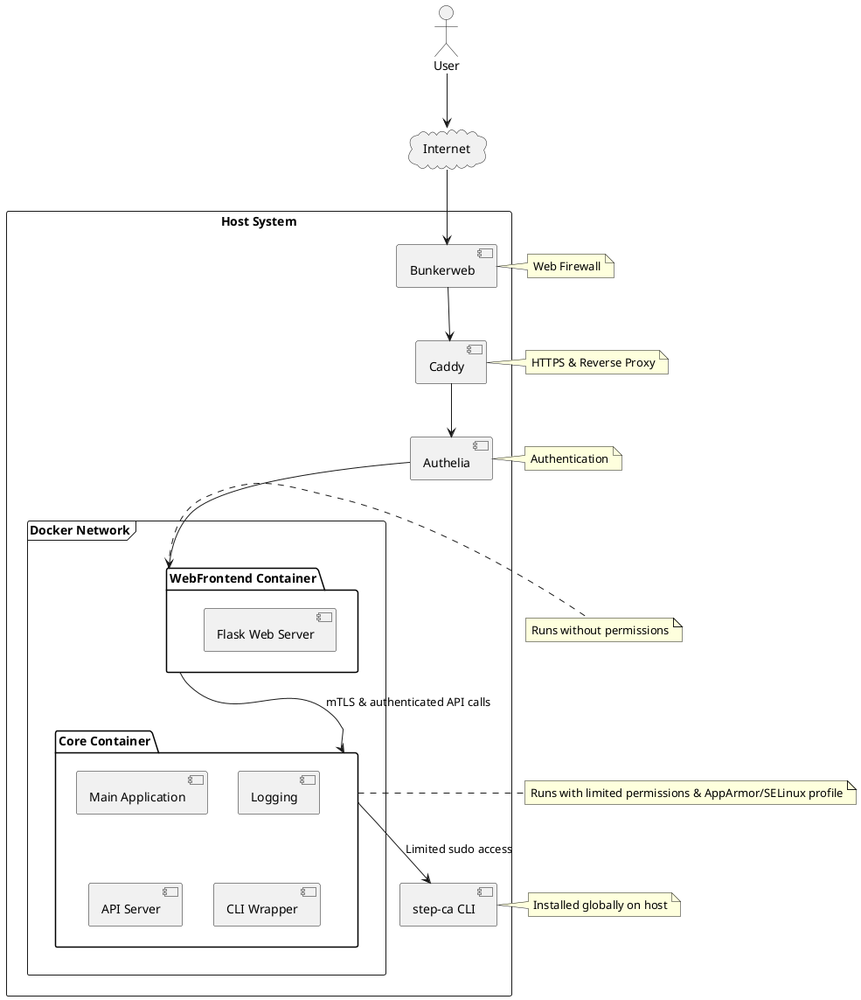
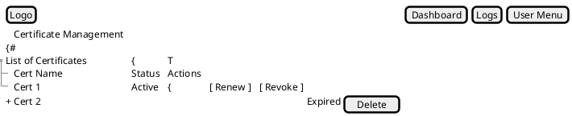

# About
The project is a web-based interface for managing a smallstep `step-ca` Certificate Authority.
In other words, it's shell wrapper for `step-ca` CLI.
It provides a user-friendly way to handle certificate operations, view logs, and manage server access.
The system is designed with security in mind, separating components with different privileges and logging all actions
for audit purposes. Written in python.

### Main Functions

#### Certificate Management
All on one page
- List certificates
- Generate new certificates (with options for key type, duration, etc.)
- Revoke certificates
- Renew certificates

#### Logging and Monitoring
- Every action such as certificate generation, revocation etc shows it's related logs immediately to user in the UI
- Every action shows shell command that it will execute
- Retrieve logs with filtering

#### Web UI
- Dashboard + Certificate Management Page
- Logs and Command History Page

#### Auto Setup
1. Install & setup `step-ca` on host
2. Create initial root certificate
3. Prepare certificates for mTLS
4. Run docker-compose.uml

### Security Features
- Separation of privileged sudo setup process from main application
- Main application runs in container with limited permissions, only `step-ca` on host is available
- Web UI is in separate basic docker container
- Input value restrictions (eg letters and numbers only for key name)
- Input sanitization in CLIWrapper to prevent command injection
- Use of subprocess module with shell=True for secure command execution
- Logging of all command executions for audit purposes
- Configuration loaded from a separate file
- Use of AppArmor/SELinux profiles for main container
- mTLS for secure communication between web frontend and main app
- Authentication via auth proxy
- Web Firewall
- Internal API keys via secret management
- Security events email alerts
- Read-only filesystem for containers

### Tech Stack
- Python
- Flask
- Docker
- Caddy (reverse proxy)
- Authelia (auth proxy)
- Bunkerweb (web firewall)
- step-ca CLI

### Additional Notes
- Type hints/dataclasses are used throughout for better code clarity and error checking
- The design allows for easy extension and maintenance
- The AutoSetup component (for initial installation and setup) is designed to be run separately with elevated privileges
- Web app auth is provided via third-party proxy, not required for this project

---
# Architecture

### Overview

```puml
@startsalt
{
  {T
    + Logo | Dashboard | Logs | User Menu
  }
  {
    {T
      + Certificate Management
      {#
        | List of Certificates |
        {T
          + Cert Name | Status | Actions
          + Cert 1 | Active | {[ Renew ] | [ Revoke ]}
          + Cert 2 | Expired | [ Delete ]
        }
      }
      [ Generate New Certificate ]
    }
  }
}

{
  {T
    + Generate New Certificate
    {
      Key Name: | "                 "
      Key Type: | ^RSA^
      Duration: | "    " ^days^
    }
    Command that will be executed:
    {
      $ step-ca command ...
    }
    Logs:
    {
      Action-specific logs appear here
    }
    [ Generate ] [ Cancel ]
  }
}
@endsalt
```

---
# TODO