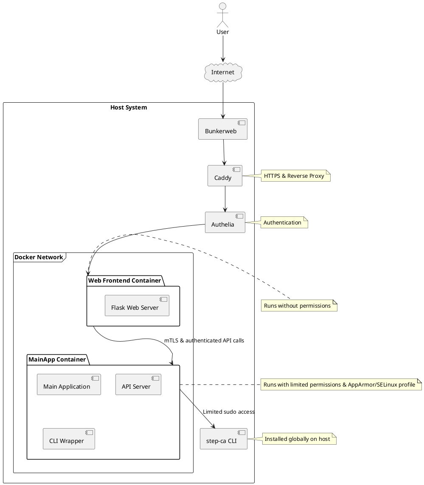
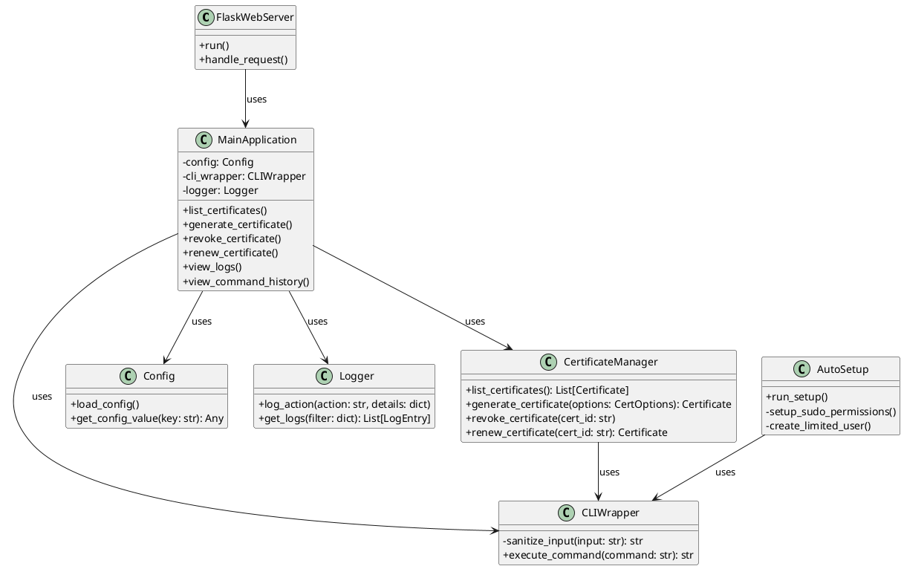
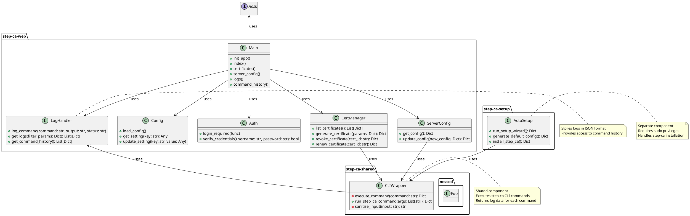

# About

The project is a web-based interface for managing a smallstep `step-ca` Certificate Authority.
In other words, it's shell wrapper for `step-ca` CLI.
It provides a user-friendly way to handle certificate operations, view logs, and manage server access.
The system is designed with security in mind, separating components with different privileges and logging all actions
for audit purposes. Written in python.

### Main Functions:

#### Certificate Management:

All on one page
- List certificates
- Generate new certificates (with options for key type, duration, etc.)
- Revoke certificates
- Renew certificates

#### Logging and Monitoring:

- View logs with filtering
- View command execution history
- Every action such as certificate generation, revocation etc shows it's related logs immediately to user in the UI
- Every action shows shell command that it's will execute

#### Web UI:

- Dashboard + Certificate Management Page
- Logs and Command History Page

### Security Features:

- Separation of privileged sudo setup process from main application
- Main process is run with special linux user with limited permissions
- Web UI is in separate unprivileged process
- Input value restrictions (eg letters and numbers only for key name)
- Input sanitization in CLIWrapper to prevent command injection
- Use of subprocess module with shell=True for secure command execution
- Logging of all command executions for audit purposes
- Configuration loaded from a separate file, not hardcoded

### Additional Notes:

- The system uses Flask as the web framework
- Type hints/dataclasses are used throughout for better code clarity and error checking
- The design allows for easy extension and maintenance
- The AutoSetup component (for initial installation and setup) is designed to be run separately with elevated privileges
- Web app auth is provided via third-party proxy, not required for this project

---
# Architecture

### Overview

### Old design

### Initial design

---
# TODO
- TLS between containers
- API request ip whitelisting
- AppArmor/SELinux profiles
- Firewall between containers?
- API keys
- Keys secrets management
- Security events email alerts
- Read-only filesystem for containers